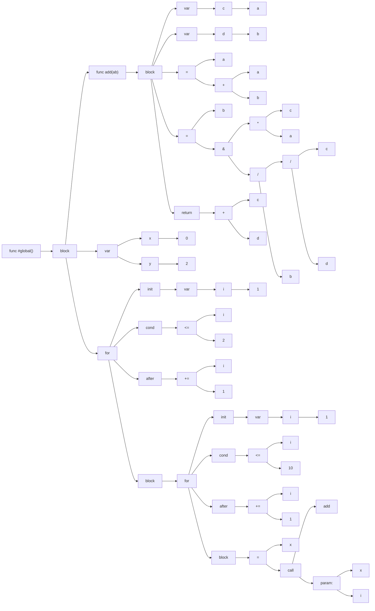

```mermaid
graph LR
1["func #global()"]
2["block"]
3["func add(ab)"]
4["block"]
5["var"]
6["c"]
5-->6
7["a"]
6-->7
4-->5
8["var"]
9["d"]
8-->9
A["b"]
9-->A
4-->8
B["="]
C["a"]
D["+"]
E["a"]
F["b"]
D-->E
D-->F
B-->C
B-->D
4-->B
10["="]
11["b"]
12["&"]
13["*"]
14["c"]
15["a"]
13-->14
13-->15
16["/"]
17["/"]
18["c"]
19["d"]
17-->18
17-->19
1A["b"]
16-->17
16-->1A
12-->13
12-->16
10-->11
10-->12
4-->10
1B["return"]
1C["+"]
1D["c"]
1E["d"]
1C-->1D
1C-->1E
1B-->1C
4-->1B
3-->4
2-->3
1F["var"]
20["x"]
1F-->20
21["0"]
20-->21
22["y"]
1F-->22
23["2"]
22-->23
2-->1F
24["for"]
25["init"]
24-->25
26["var"]
27["i"]
26-->27
28["1"]
27-->28
25-->26
29["cond"]
24-->29
2A["<="]
2B["i"]
2C["2"]
2A-->2B
2A-->2C
29-->2A
2D["after"]
24-->2D
2E["+="]
2F["i"]
30["1"]
2E-->2F
2E-->30
2D-->2E
31["block"]
32["for"]
33["init"]
32-->33
34["var"]
35["i"]
34-->35
36["1"]
35-->36
33-->34
37["cond"]
32-->37
38["<="]
39["i"]
3A["10"]
38-->39
38-->3A
37-->38
3B["after"]
32-->3B
3C["+="]
3D["i"]
3E["1"]
3C-->3D
3C-->3E
3B-->3C
3F["block"]
40["="]
41["x"]
42["call"]
43["add"]
42-->43
44["param:"]
42-->44
45["x"]
44-->45
46["i"]
44-->46
40-->41
40-->42
3F-->40
32-->3F
31-->32
24-->31
2-->24
1-->2
```
