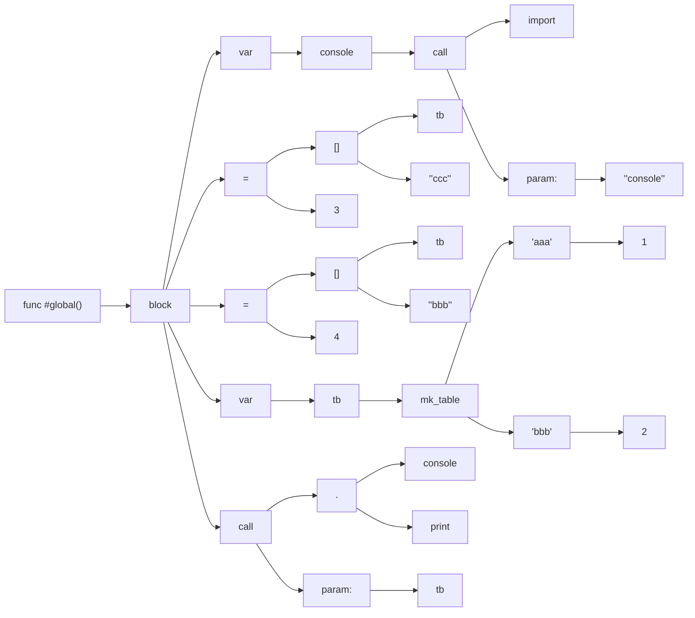

```mermaid
graph LR
1["func #global()"]
2["block"]
3["var"]
4["console"]
3-->4
5["call"]
6["import"]
5-->6
7["param:"]
5-->7
8["''console''"]
7-->8
4-->5
2-->3
9["var"]
A["tb"]
9-->A
B["mk_table"]
C["'aaa'"]
B-->C
D["1"]
C-->D
E["'bbb'"]
B-->E
F["2"]
E-->F
A-->B
2-->9
10["="]
11["[]"]
12["tb"]
13["''ccc''"]
11-->12
11-->13
14["3"]
10-->11
10-->14
2-->10
15["="]
16["[]"]
17["tb"]
18["''bbb''"]
16-->17
16-->18
19["4"]
15-->16
15-->19
2-->15
1A["call"]
1B["."]
1C["console"]
1D["print"]
1B-->1C
1B-->1D
1A-->1B
1E["param:"]
1A-->1E
1F["tb"]
1E-->1F
2-->1A
1-->2
```
