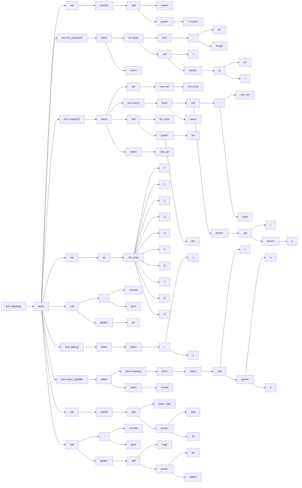

```mermaid
graph LR
1["func #global()"]
2["block"]
3["var"]
4["console"]
3-->4
5["call"]
6["import"]
5-->6
7["param:"]
5-->7
8["''console''"]
7-->8
4-->5
2-->3
9["func for_each(arrf)"]
A["block"]
B["for range"]
C["."]
D["arr"]
E["length"]
C-->D
C-->E
F["end:"]
F-->C
B-->F
10["call"]
11["f"]
10-->11
12["param:"]
10-->12
13["[]"]
14["arr"]
15["i"]
13-->14
13-->15
12-->13
B-->10
A-->B
16["return"]
A-->16
9-->A
2-->9
17["func map(arrf)"]
18["block"]
19["var"]
1A["new_arr"]
19-->1A
1B["mk_array"]
1A-->1B
18-->19
1C["func iter(x)"]
1D["block"]
1E["call"]
1F["."]
20["new_arr"]
21["push"]
1F-->20
1F-->21
1E-->1F
22["param:"]
1E-->22
23["call"]
24["f"]
23-->24
25["param:"]
23-->25
26["x"]
25-->26
22-->23
1D-->1E
27["return"]
1D-->27
1C-->1D
18-->1C
28["call"]
29["for_each"]
28-->29
2A["param:"]
28-->2A
2B["arr"]
2A-->2B
2C["iter"]
2A-->2C
18-->28
2D["return"]
2E["new_arr"]
2D-->2E
18-->2D
17-->18
2-->17
2F["var"]
30["arr"]
2F-->30
31["mk_array"]
32["0"]
31-->32
33["1"]
31-->33
34["2"]
31-->34
35["3"]
31-->35
36["4"]
31-->36
37["5"]
31-->37
38["6"]
31-->38
39["7"]
31-->39
3A["8"]
31-->3A
3B["9"]
31-->3B
30-->31
2-->2F
3C["call"]
3D["."]
3E["console"]
3F["print"]
3D-->3E
3D-->3F
3C-->3D
40["param:"]
3C-->40
41["arr"]
40-->41
2-->3C
42["func add(xy)"]
43["block"]
44["return"]
45["+"]
46["x"]
47["y"]
45-->46
45-->47
44-->45
43-->44
42-->43
2-->42
48["func place_right(fb)"]
49["block"]
4A["func invoke(a)"]
4B["block"]
4C["return"]
4D["call"]
4E["f"]
4D-->4E
4F["param:"]
4D-->4F
50["a"]
4F-->50
51["b"]
4F-->51
4C-->4D
4B-->4C
4A-->4B
49-->4A
52["return"]
53["invoke"]
52-->53
49-->52
48-->49
2-->48
54["var"]
55["add10"]
54-->55
56["call"]
57["place_right"]
56-->57
58["param:"]
56-->58
59["add"]
58-->59
5A["10"]
58-->5A
55-->56
2-->54
5B["call"]
5C["."]
5D["console"]
5E["print"]
5C-->5D
5C-->5E
5B-->5C
5F["param:"]
5B-->5F
60["call"]
61["map"]
60-->61
62["param:"]
60-->62
63["arr"]
62-->63
64["add10"]
62-->64
5F-->60
2-->5B
1-->2
```
