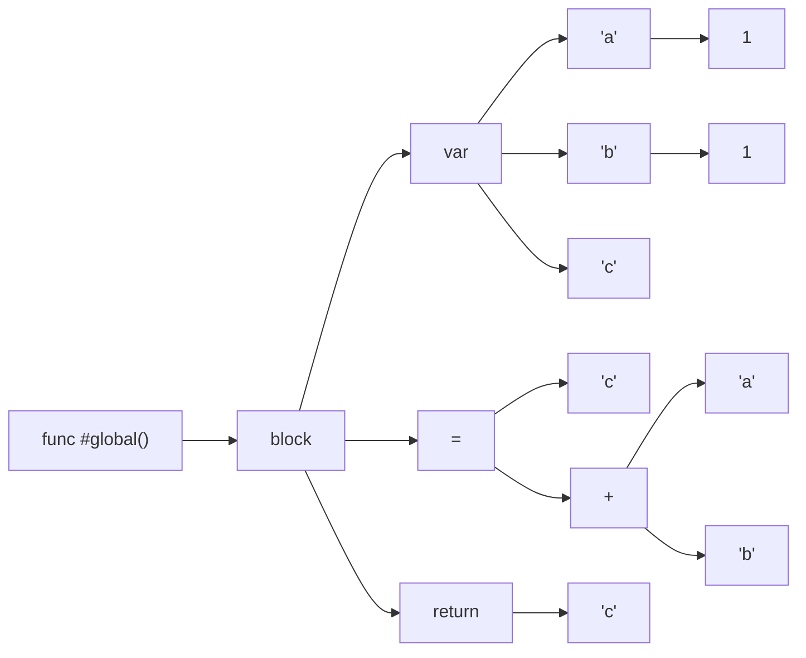

```mermaid
graph LR
1["func #global()"]
2["block"]
3["var"]
4["'a'"]
3-->4
5["1"]
4-->5
6["'b'"]
3-->6
7["1"]
6-->7
8["'c'"]
3-->8
2-->3
9["="]
A["'c'"]
B["+"]
C["'a'"]
D["'b'"]
B-->C
B-->D
9-->A
9-->B
2-->9
E["return"]
F["'c'"]
E-->F
2-->E
1-->2
```
