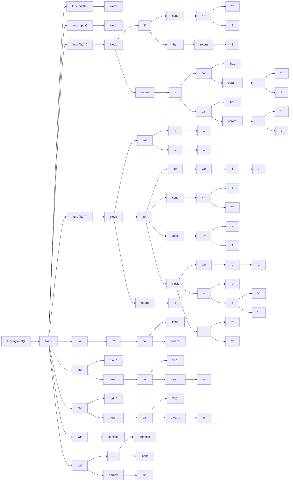

```mermaid
graph LR
1["func #global()"]
2["block"]
3["func print(x)"]
4["block"]
3-->4
2-->3
5["func input()"]
6["block"]
5-->6
2-->5
7["func fib1(n)"]
8["block"]
9["if"]
A["cond"]
9-->A
B["<="]
C["'n'"]
D["2"]
B-->C
B-->D
A-->B
E["then"]
9-->E
F["return"]
10["1"]
F-->10
E-->F
8-->9
11["return"]
12["+"]
13["call"]
14["'fib1'"]
13-->14
15["param:"]
13-->15
16["-"]
17["'n'"]
18["2"]
16-->17
16-->18
15-->16
19["call"]
1A["'fib1'"]
19-->1A
1B["param:"]
19-->1B
1C["-"]
1D["'n'"]
1E["1"]
1C-->1D
1C-->1E
1B-->1C
12-->13
12-->19
11-->12
8-->11
7-->8
2-->7
1F["func fib2(n)"]
20["block"]
21["var"]
22["'a'"]
21-->22
23["1"]
22-->23
24["'b'"]
21-->24
25["1"]
24-->25
20-->21
26["for"]
27["init"]
26-->27
28["var"]
29["'i'"]
28-->29
2A["3"]
29-->2A
27-->28
2B["cond"]
26-->2B
2C["<="]
2D["'i'"]
2E["'n'"]
2C-->2D
2C-->2E
2B-->2C
2F["after"]
26-->2F
30["+="]
31["'i'"]
32["1"]
30-->31
30-->32
2F-->30
33["block"]
34["var"]
35["'c'"]
34-->35
36["'a'"]
35-->36
33-->34
37["="]
38["'a'"]
39["+"]
3A["'a'"]
3B["'b'"]
39-->3A
39-->3B
37-->38
37-->39
33-->37
3C["="]
3D["'b'"]
3E["'a'"]
3C-->3D
3C-->3E
33-->3C
26-->33
20-->26
3F["return"]
40["'a'"]
3F-->40
20-->3F
1F-->20
2-->1F
41["var"]
42["'n'"]
41-->42
43["call"]
44["'input'"]
43-->44
45["param:"]
43-->45
42-->43
2-->41
46["call"]
47["'print'"]
46-->47
48["param:"]
46-->48
49["call"]
4A["'fib1'"]
49-->4A
4B["param:"]
49-->4B
4C["'n'"]
4B-->4C
48-->49
2-->46
4D["call"]
4E["'print'"]
4D-->4E
4F["param:"]
4D-->4F
50["call"]
51["'fib2'"]
50-->51
52["param:"]
50-->52
53["'n'"]
52-->53
4F-->50
2-->4D
54["var"]
55["'console'"]
54-->55
2-->54
56["call"]
57["."]
58["'console'"]
59["'print'"]
57-->58
57-->59
56-->57
5A["param:"]
56-->5A
5B["123"]
5A-->5B
2-->56
1-->2
```
