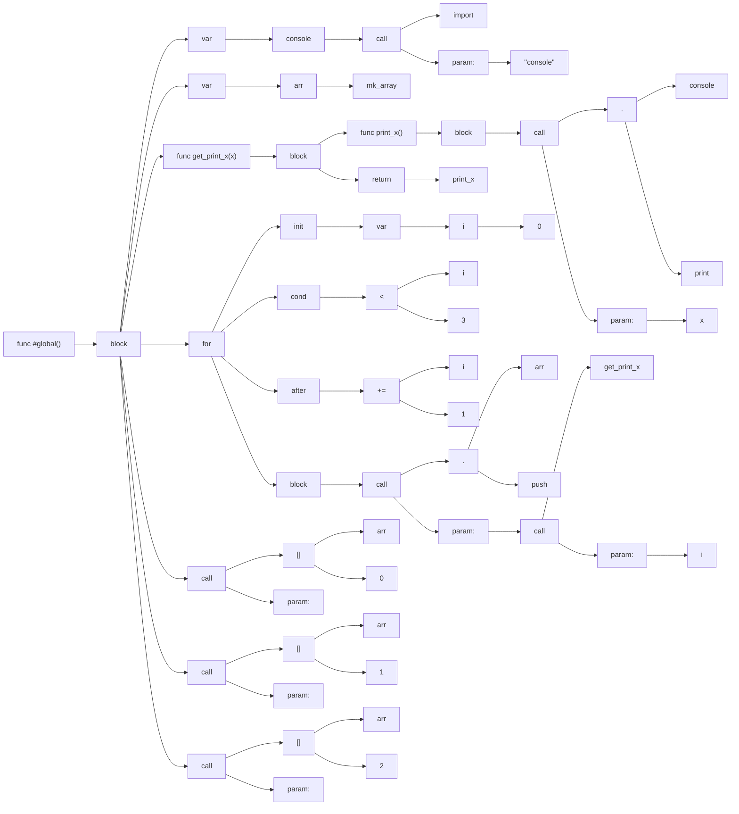

```mermaid
graph LR
1["func #global()"]
2["block"]
3["var"]
4["console"]
3-->4
5["call"]
6["import"]
5-->6
7["param:"]
5-->7
8["''console''"]
7-->8
4-->5
2-->3
9["var"]
A["arr"]
9-->A
B["mk_array"]
A-->B
2-->9
C["func get_print_x(x)"]
D["block"]
E["func print_x()"]
F["block"]
10["call"]
11["."]
12["console"]
13["print"]
11-->12
11-->13
10-->11
14["param:"]
10-->14
15["x"]
14-->15
F-->10
E-->F
D-->E
16["return"]
17["print_x"]
16-->17
D-->16
C-->D
2-->C
18["for"]
19["init"]
18-->19
1A["var"]
1B["i"]
1A-->1B
1C["0"]
1B-->1C
19-->1A
1D["cond"]
18-->1D
1E["<"]
1F["i"]
20["3"]
1E-->1F
1E-->20
1D-->1E
21["after"]
18-->21
22["+="]
23["i"]
24["1"]
22-->23
22-->24
21-->22
25["block"]
26["call"]
27["."]
28["arr"]
29["push"]
27-->28
27-->29
26-->27
2A["param:"]
26-->2A
2B["call"]
2C["get_print_x"]
2B-->2C
2D["param:"]
2B-->2D
2E["i"]
2D-->2E
2A-->2B
25-->26
18-->25
2-->18
2F["call"]
30["[]"]
31["arr"]
32["0"]
30-->31
30-->32
2F-->30
33["param:"]
2F-->33
2-->2F
34["call"]
35["[]"]
36["arr"]
37["1"]
35-->36
35-->37
34-->35
38["param:"]
34-->38
2-->34
39["call"]
3A["[]"]
3B["arr"]
3C["2"]
3A-->3B
3A-->3C
39-->3A
3D["param:"]
39-->3D
2-->39
1-->2
```
