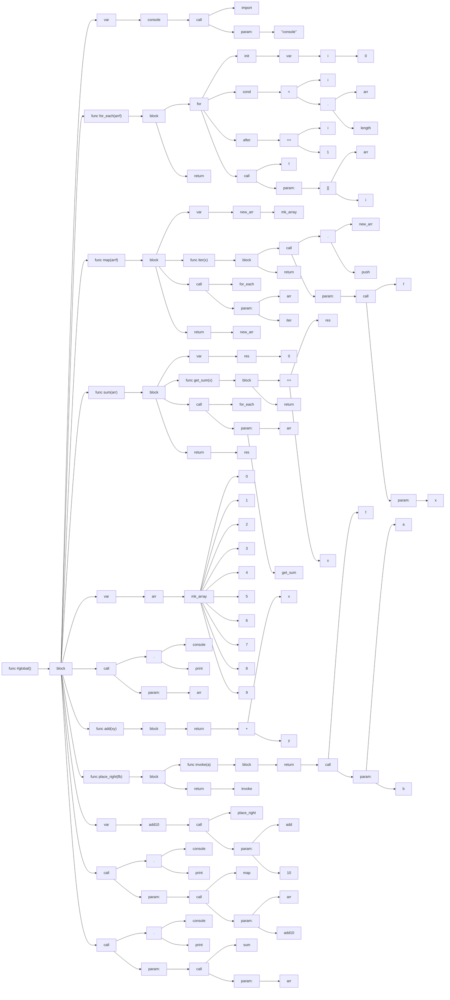

```mermaid
graph LR
1["func #global()"]
2["block"]
3["var"]
4["console"]
3-->4
5["call"]
6["import"]
5-->6
7["param:"]
5-->7
8["''console''"]
7-->8
4-->5
2-->3
9["func for_each(arrf)"]
A["block"]
B["for"]
C["init"]
B-->C
D["var"]
E["i"]
D-->E
F["0"]
E-->F
C-->D
10["cond"]
B-->10
11["<"]
12["i"]
13["."]
14["arr"]
15["length"]
13-->14
13-->15
11-->12
11-->13
10-->11
16["after"]
B-->16
17["+="]
18["i"]
19["1"]
17-->18
17-->19
16-->17
1A["call"]
1B["f"]
1A-->1B
1C["param:"]
1A-->1C
1D["[]"]
1E["arr"]
1F["i"]
1D-->1E
1D-->1F
1C-->1D
B-->1A
A-->B
20["return"]
A-->20
9-->A
2-->9
21["func map(arrf)"]
22["block"]
23["var"]
24["new_arr"]
23-->24
25["mk_array"]
24-->25
22-->23
26["func iter(x)"]
27["block"]
28["call"]
29["."]
2A["new_arr"]
2B["push"]
29-->2A
29-->2B
28-->29
2C["param:"]
28-->2C
2D["call"]
2E["f"]
2D-->2E
2F["param:"]
2D-->2F
30["x"]
2F-->30
2C-->2D
27-->28
31["return"]
27-->31
26-->27
22-->26
32["call"]
33["for_each"]
32-->33
34["param:"]
32-->34
35["arr"]
34-->35
36["iter"]
34-->36
22-->32
37["return"]
38["new_arr"]
37-->38
22-->37
21-->22
2-->21
39["func sum(arr)"]
3A["block"]
3B["var"]
3C["res"]
3B-->3C
3D["0"]
3C-->3D
3A-->3B
3E["func get_sum(x)"]
3F["block"]
40["+="]
41["res"]
42["x"]
40-->41
40-->42
3F-->40
43["return"]
3F-->43
3E-->3F
3A-->3E
44["call"]
45["for_each"]
44-->45
46["param:"]
44-->46
47["arr"]
46-->47
48["get_sum"]
46-->48
3A-->44
49["return"]
4A["res"]
49-->4A
3A-->49
39-->3A
2-->39
4B["var"]
4C["arr"]
4B-->4C
4D["mk_array"]
4E["0"]
4D-->4E
4F["1"]
4D-->4F
50["2"]
4D-->50
51["3"]
4D-->51
52["4"]
4D-->52
53["5"]
4D-->53
54["6"]
4D-->54
55["7"]
4D-->55
56["8"]
4D-->56
57["9"]
4D-->57
4C-->4D
2-->4B
58["call"]
59["."]
5A["console"]
5B["print"]
59-->5A
59-->5B
58-->59
5C["param:"]
58-->5C
5D["arr"]
5C-->5D
2-->58
5E["func add(xy)"]
5F["block"]
60["return"]
61["+"]
62["x"]
63["y"]
61-->62
61-->63
60-->61
5F-->60
5E-->5F
2-->5E
64["func place_right(fb)"]
65["block"]
66["func invoke(a)"]
67["block"]
68["return"]
69["call"]
6A["f"]
69-->6A
6B["param:"]
69-->6B
6C["a"]
6B-->6C
6D["b"]
6B-->6D
68-->69
67-->68
66-->67
65-->66
6E["return"]
6F["invoke"]
6E-->6F
65-->6E
64-->65
2-->64
70["var"]
71["add10"]
70-->71
72["call"]
73["place_right"]
72-->73
74["param:"]
72-->74
75["add"]
74-->75
76["10"]
74-->76
71-->72
2-->70
77["call"]
78["."]
79["console"]
7A["print"]
78-->79
78-->7A
77-->78
7B["param:"]
77-->7B
7C["call"]
7D["map"]
7C-->7D
7E["param:"]
7C-->7E
7F["arr"]
7E-->7F
80["add10"]
7E-->80
7B-->7C
2-->77
81["call"]
82["."]
83["console"]
84["print"]
82-->83
82-->84
81-->82
85["param:"]
81-->85
86["call"]
87["sum"]
86-->87
88["param:"]
86-->88
89["arr"]
88-->89
85-->86
2-->81
1-->2
```
