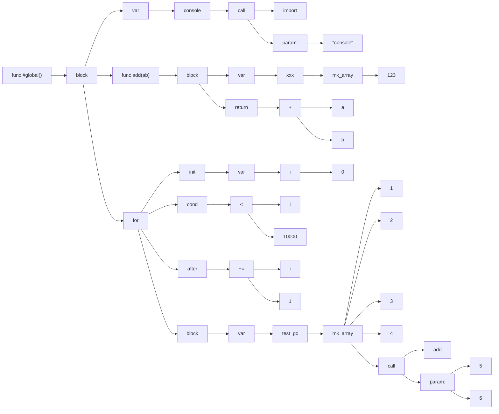

```mermaid
graph LR
1["func #global()"]
2["block"]
3["var"]
4["console"]
3-->4
5["call"]
6["import"]
5-->6
7["param:"]
5-->7
8["''console''"]
7-->8
4-->5
2-->3
9["func add(ab)"]
A["block"]
B["var"]
C["xxx"]
B-->C
D["mk_array"]
E["123"]
D-->E
C-->D
A-->B
F["return"]
10["+"]
11["a"]
12["b"]
10-->11
10-->12
F-->10
A-->F
9-->A
2-->9
13["for"]
14["init"]
13-->14
15["var"]
16["i"]
15-->16
17["0"]
16-->17
14-->15
18["cond"]
13-->18
19["<"]
1A["i"]
1B["10000"]
19-->1A
19-->1B
18-->19
1C["after"]
13-->1C
1D["+="]
1E["i"]
1F["1"]
1D-->1E
1D-->1F
1C-->1D
20["block"]
21["var"]
22["test_gc"]
21-->22
23["mk_array"]
24["1"]
23-->24
25["2"]
23-->25
26["3"]
23-->26
27["4"]
23-->27
28["call"]
29["add"]
28-->29
2A["param:"]
28-->2A
2B["5"]
2A-->2B
2C["6"]
2A-->2C
23-->28
22-->23
20-->21
13-->20
2-->13
1-->2
```
