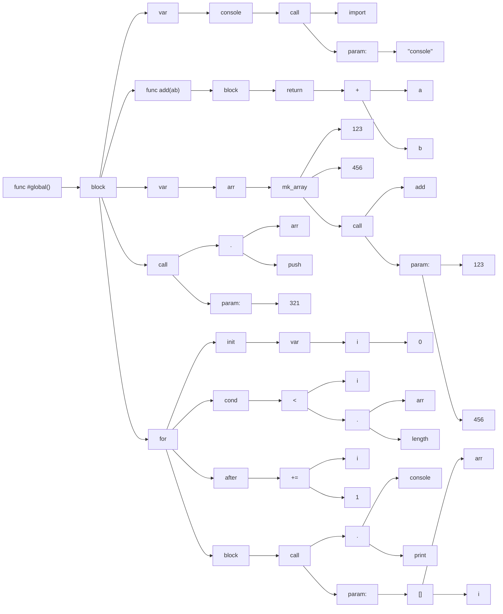

```mermaid
graph LR
1["func #global()"]
2["block"]
3["var"]
4["console"]
3-->4
5["call"]
6["import"]
5-->6
7["param:"]
5-->7
8["''console''"]
7-->8
4-->5
2-->3
9["func add(ab)"]
A["block"]
B["return"]
C["+"]
D["a"]
E["b"]
C-->D
C-->E
B-->C
A-->B
9-->A
2-->9
F["var"]
10["arr"]
F-->10
11["mk_array"]
12["123"]
11-->12
13["456"]
11-->13
14["call"]
15["add"]
14-->15
16["param:"]
14-->16
17["123"]
16-->17
18["456"]
16-->18
11-->14
10-->11
2-->F
19["call"]
1A["."]
1B["arr"]
1C["push"]
1A-->1B
1A-->1C
19-->1A
1D["param:"]
19-->1D
1E["321"]
1D-->1E
2-->19
1F["for"]
20["init"]
1F-->20
21["var"]
22["i"]
21-->22
23["0"]
22-->23
20-->21
24["cond"]
1F-->24
25["<"]
26["i"]
27["."]
28["arr"]
29["length"]
27-->28
27-->29
25-->26
25-->27
24-->25
2A["after"]
1F-->2A
2B["+="]
2C["i"]
2D["1"]
2B-->2C
2B-->2D
2A-->2B
2E["block"]
2F["call"]
30["."]
31["console"]
32["print"]
30-->31
30-->32
2F-->30
33["param:"]
2F-->33
34["[]"]
35["arr"]
36["i"]
34-->35
34-->36
33-->34
2E-->2F
1F-->2E
2-->1F
1-->2
```
