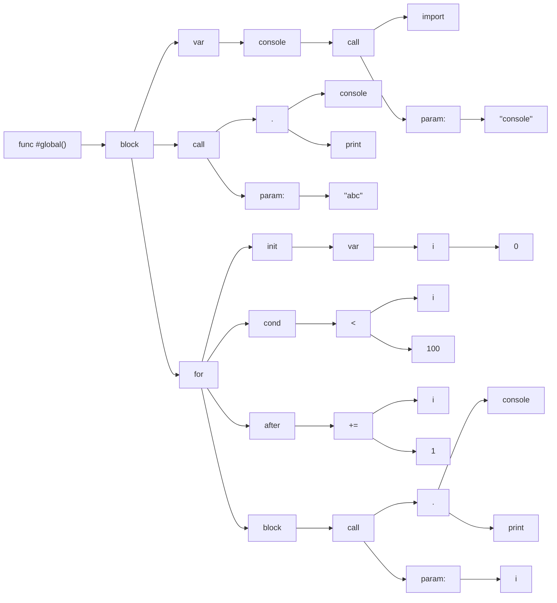

```mermaid
graph LR
1["func #global()"]
2["block"]
3["var"]
4["console"]
3-->4
5["call"]
6["import"]
5-->6
7["param:"]
5-->7
8["''console''"]
7-->8
4-->5
2-->3
9["call"]
A["."]
B["console"]
C["print"]
A-->B
A-->C
9-->A
D["param:"]
9-->D
E["''abc''"]
D-->E
2-->9
F["for"]
10["init"]
F-->10
11["var"]
12["i"]
11-->12
13["0"]
12-->13
10-->11
14["cond"]
F-->14
15["<"]
16["i"]
17["100"]
15-->16
15-->17
14-->15
18["after"]
F-->18
19["+="]
1A["i"]
1B["1"]
19-->1A
19-->1B
18-->19
1C["block"]
1D["call"]
1E["."]
1F["console"]
20["print"]
1E-->1F
1E-->20
1D-->1E
21["param:"]
1D-->21
22["i"]
21-->22
1C-->1D
F-->1C
2-->F
1-->2
```
