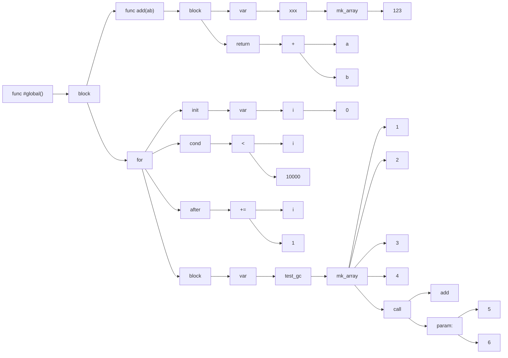

```mermaid
graph LR
1["func #global()"]
2["block"]
3["func add(ab)"]
4["block"]
5["var"]
6["xxx"]
5-->6
7["mk_array"]
8["123"]
7-->8
6-->7
4-->5
9["return"]
A["+"]
B["a"]
C["b"]
A-->B
A-->C
9-->A
4-->9
3-->4
2-->3
D["for"]
E["init"]
D-->E
F["var"]
10["i"]
F-->10
11["0"]
10-->11
E-->F
12["cond"]
D-->12
13["<"]
14["i"]
15["10000"]
13-->14
13-->15
12-->13
16["after"]
D-->16
17["+="]
18["i"]
19["1"]
17-->18
17-->19
16-->17
1A["block"]
1B["var"]
1C["test_gc"]
1B-->1C
1D["mk_array"]
1E["1"]
1D-->1E
1F["2"]
1D-->1F
20["3"]
1D-->20
21["4"]
1D-->21
22["call"]
23["add"]
22-->23
24["param:"]
22-->24
25["5"]
24-->25
26["6"]
24-->26
1D-->22
1C-->1D
1A-->1B
D-->1A
2-->D
1-->2
```
