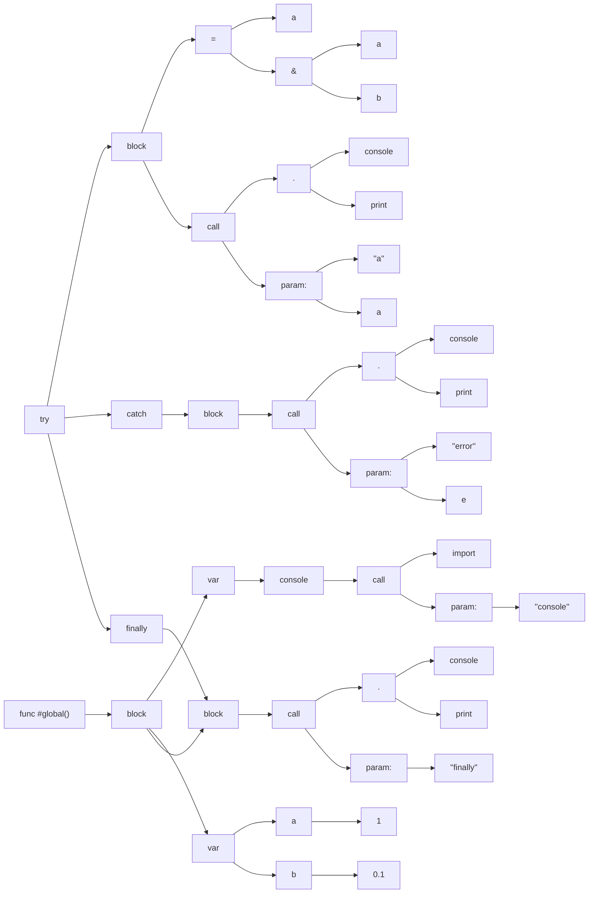

```mermaid
graph LR
1["func #global()"]
2["block"]
3["var"]
4["console"]
3-->4
5["call"]
6["import"]
5-->6
7["param:"]
5-->7
8["''console''"]
7-->8
4-->5
2-->3
9["var"]
A["a"]
9-->A
B["1"]
A-->B
C["b"]
9-->C
D["0.1"]
C-->D
2-->9
E["try"]
F["catch"]
10["block"]
11["="]
12["a"]
13["&"]
14["a"]
15["b"]
13-->14
13-->15
11-->12
11-->13
10-->11
16["call"]
17["."]
18["console"]
19["print"]
17-->18
17-->19
16-->17
1A["param:"]
16-->1A
1B["''a''"]
1A-->1B
1C["a"]
1A-->1C
10-->16
E-->10
1D["block"]
1E["call"]
1F["."]
20["console"]
21["print"]
1F-->20
1F-->21
1E-->1F
22["param:"]
1E-->22
23["''error''"]
22-->23
24["e"]
22-->24
1D-->1E
F-->1D
E-->F
25["finally"]
E-->25
26["block"]
27["call"]
28["."]
29["console"]
2A["print"]
28-->29
28-->2A
27-->28
2B["param:"]
27-->2B
2C["''finally''"]
2B-->2C
26-->27
25-->26
2-->26
1-->2
```
