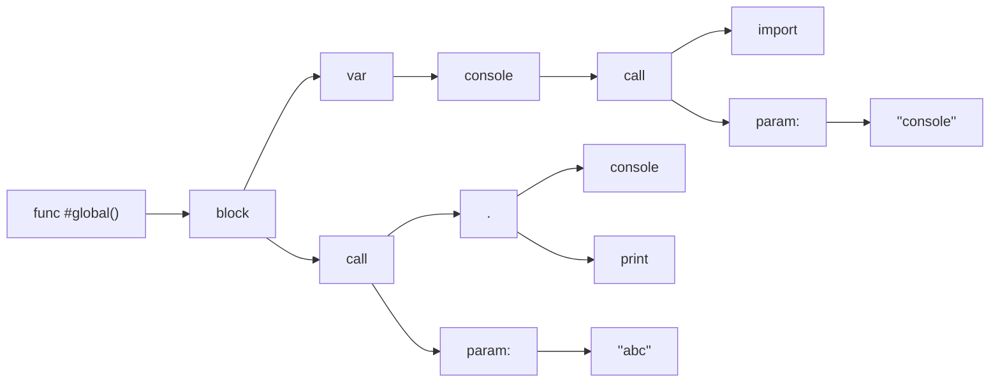

```mermaid
graph LR
1["func #global()"]
2["block"]
3["var"]
4["console"]
3-->4
5["call"]
6["import"]
5-->6
7["param:"]
5-->7
8["''console''"]
7-->8
4-->5
2-->3
9["call"]
A["."]
B["console"]
C["print"]
A-->B
A-->C
9-->A
D["param:"]
9-->D
E["''abc''"]
D-->E
2-->9
1-->2
```
